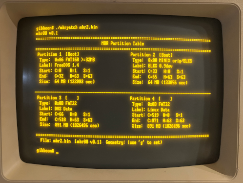

# MBR88
An OS independent 8088 op-code clean MBR for dual booting ELKS, FreeDOS or even
modern operating systems. Includes an MBR Patching tool compiles that natively
for linux and cross compiles for [ELKS](https://github.com/ghaerr/elks) via
[ia16-gcc](https://github.com/tkchia/gcc-ia16), and [FreeDOS](https://github.com/FDOS) 
via [OpenWatcom](https://github.com/open-watcom).  MBR assembly is provided in
NASM native syntax.

Safe for ELKS, but *don't use this yet on FreeDOS yet, currently still testing the
Watcom build of mbrpatch.*

The MBR reserves space within it's tiny 512 byte area for volume names to display
in the boot menu.  MBR88 always presents a boot menu and waits for user input.  Since 
it never auto-boots it's good for desktops, but not suitable for servers.  Only
partitions marked with the 0x80 bootable flag appear in the menu but up to *four*
partitions may be simultaneously marked as bootable.  The boot menu also allows for
booting from a floppy even if it's installed on the first hardrive or or flash card.

## Usage

```bash
mbrpatch -r backup.bin /dev/hda     # read live MBR to file (ELKS / Linux)
mbrpatch -r backup.bin 80h          # read live MBR to file (FreeDOS)

mbrpatch -r backup.bin /dev/hda     # inspect the partition table

mbrpatch -u mbr.bin                 # upgrade old MBR to MBR88, then edit
mbrpatch -w mbr.bin /dev/hda        # write MBR to disk (ELKS / Linux)
mbrpatch -w mbr.bin 80h             # write MBR to disk (FreeDOS)
mbrpatch -n new.bin                 # create a fresh MBR88 image
```
Windows NT disk IDs are supported and may be modified if desired.

## GPT, LILO and GRUB

As a safety feature, if `mbrpatch` detects a special record such as a GPT disk
or a GRUB first stage loader it will refuse to alter it.  You can pull such
records but not change them.  Only traditional MBRs are supported.



## Commemoration

Embedded in unused region of an MBR88 record is the last byte that I
could get off the Cassini spacecraft as it plummeted into Saturn.  As far as
I know it was the last complete byte to make it to Earth from the mission.
She was a good ship, run by an even better team. Details are in the source
comments.

## Development

Written by C. Piker and Claude (Anthropic).  Verified on a Leading Edge Model D with
two floppy drives and a SD card reader with XTIDE installed. More hardware and OS
verification is in the works.

## Acknowledgement
Thanks to osdev.org for the reference material and insights that informed the
design of this boot record, especially the creators of [this page](https://wiki.osdev.org/MBR_(x86)).
